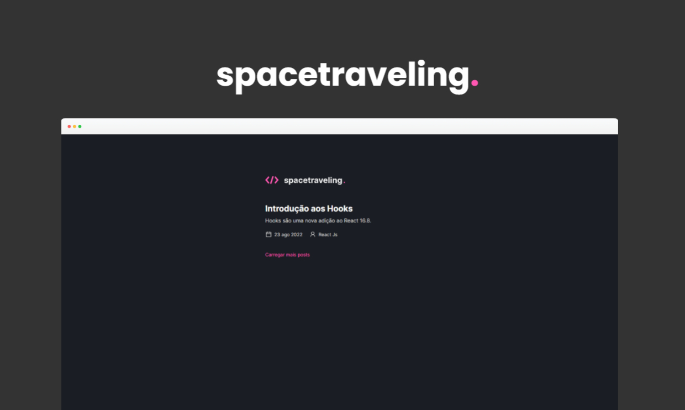
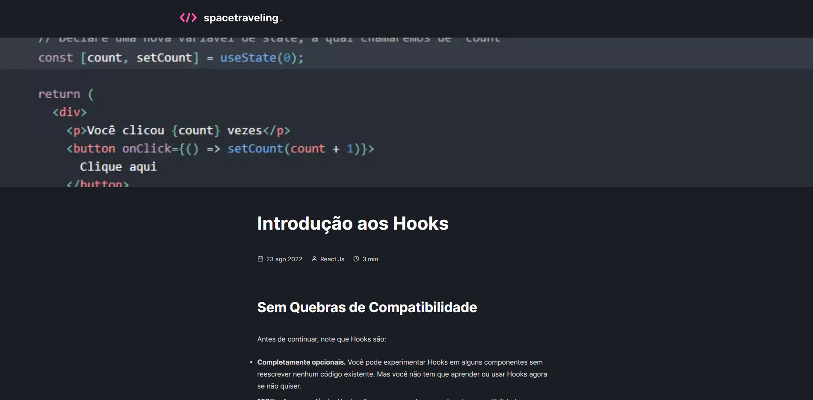

___

<div align="center">
    
</div>

## 💻 Desafio

O projeto tem como objetivo o estudo e desenvolvimento de uma aplicação em ReactJS com NextJS para listagem de posts de um blog.

A aplicação foi desenvolvida utilizando o framework NextJS aplicando os conceitos de Static Site Generation (SSG) e Server Side Rendering (SSR) e utilizando Prismic CMS para adição e gerenciamento do conteúdo dos posts.

<details>
<summary>Alguns desafios dessa aplicação</summary>

- Estilizações global e individuais;
- Importação de fontes Google;
- Paginação de posts;
- Cálculo de tempo estimado de leitura do post;
- Geração de páginas estáticas com os métodos `getStaticProps` e `getStaticPaths`;
- Formatação de datas com `date-fns`;
- Uso de ícones com `react-icons`;
- Requisições HTTP com `fetch`;
- Entre outros.
-
</details>
<br>



Essa é uma aplicação Serverless, ou seja, todo o processo que dependeria de um backend foi integrado dentro do front e seguindo o padrão da JAMStack.

As postagens são feitas pelo painel do Prismic CMS e integradas diretamente pelo front.




## :rocket: Tecnologias

As seguintes tecnologias foram utilizadas no projeto:

- [React.js](https://pt-br.reactjs.org/)
- [Next.js](https://nextjs.org/)
- [TypeScript](https://www.typescriptlang.org/)
- [SASS](https://sass-lang.com/)
- [Prismic CMS](https://prismic.io/)

## 🔖 Funcionalidades:
- Acessar posts cadastrados no CMS


## :white_check_mark: Requerimentos

- [Node](https://nodejs.org/en/)
- [Yarn](https://yarnpkg.com/lang/en/)
- [Prismic CMS](https://prismic.io)

## :checkered_flag: Começando

```bash

# This project needs a API Key from Prismic at .local.env called PRISMIC_API_ENDPOINT

# Clone this project
$ git clone https://github.com/ricardoltt/spacetravelling

# Access
$ cd spacetravelling

# Install dependencies
$ yarn

# Run the project
$ yarn dev

# The server will initialize in the <http://localhost:3000>
```

<div align="center">

### Let's code! 🚀

Made with love by **Ricardo Temoteo** ❤️ Me adiciona no [Linkedin!](https://www.linkedin.com/in/ricardoltt/)

</div>

